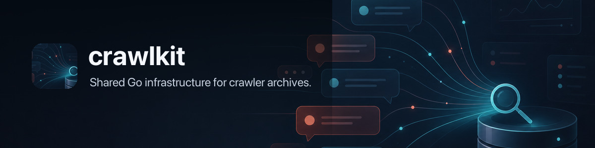

# crawlkit 🧰 — one kit, many crawlers



[](https://github.com/openclaw/crawlkit/actions/workflows/ci.yml)
[](https://pkg.go.dev/github.com/openclaw/crawlkit)
[](https://go.dev/)
[](LICENSE)

`crawlkit` is the shared Go library for local-first crawler archives. It gives crawler authors provider-neutral building blocks for config paths, SQLite stores, snapshots, backups, synchronization, search, terminal interfaces, and automation.

Provider APIs, authentication, schemas, privacy filters, and user-facing command contracts stay in the downstream crawl apps.

## Install

`crawlkit` requires Go 1.27.0 or newer.

Add the package you need to a Go module. For the quick start below:

```sh
go get github.com/openclaw/crawlkit/store@latest
```

Install the optional archive controller:

```sh
go install github.com/openclaw/crawlkit/cmd/crawlctl@latest
```

The latest module version is available through the Go module proxy. Signed CLI archives and the release process are documented in [Publishing Crawlkit](docs/publishing.md).

## Quick start

This example opens an in-memory SQLite store with crawlkit's connection defaults, applies a schema, writes a row, and reads it back:

```go
package main

import (
	"context"
	"fmt"

	"github.com/openclaw/crawlkit/store"
)

func main() {
	ctx := context.Background()
	db, err := store.Open(ctx, store.Options{
		Path:   ":memory:",
		Schema: `create table items (title text not null)`,
	})
	if err != nil {
		panic(err)
	}
	defer db.Close()

	if _, err := db.DB().ExecContext(ctx, `insert into items values (?)`, "first crawl"); err != nil {
		panic(err)
	}
	rows, err := db.Query(ctx, `select title from items`)
	if err != nil {
		panic(err)
	}
	fmt.Println(rows.Values[0]["title"])
}
```

Run it from a module that depends on `crawlkit`:

```sh
go run .
```

```text
first crawl
```

## Package map

| Area | Packages | What they own |
| --- | --- | --- |
| Local data | `config`, `store`, `state`, `cache` | Runtime paths, SQLite access, sync cursors, and safe cache snapshots |
| Portable archives | `snapshot`, `backup`, `mirror` | JSONL/Gzip packs, encrypted backups, sidecars, and Git-backed history |
| Search | `embed`, `vector` | Embedding providers, vector encoding, exact search, and result fusion |
| App contracts | `control`, `output`, `progress` | Machine-readable metadata, output formats, and CI-safe progress logs |
| Remote archives | `remote` | Provider-neutral HTTP client and versioned archive protocol |
| User surfaces | `scheduler`, `tui`, `releasecheck` | Refresh jobs, terminal browsing, and release notices |

See the [package guide](docs/packages.md) for the complete inventory and [Go package reference](https://pkg.go.dev/github.com/openclaw/crawlkit) for exported APIs.

## crawlctl

`crawlctl` discovers installed crawl apps through their machine-readable metadata, runs configured refresh jobs under a single-process lock, and records JSONL run history.

If a write is interrupted, history reads ignore a truncated final JSON value and the next run repairs that tail before appending. Valid final records without a trailing newline are retained; complete corrupt records still report an error.

| Command | Purpose |
| --- | --- |
| `init` | Discover crawl apps and write a controller config |
| `discover` | Print discovered crawl apps |
| `run` | Run enabled refresh jobs |
| `status` | Show the latest recorded job status |
| `logs` | Print recent job logs |
| `install` | Install or render a periodic schedule |
| `uninstall` | Remove an installed periodic schedule |

Scheduling uses launchd on macOS, systemd user units on Linux, Task Scheduler on Windows, and cron rendering as the portable fallback.

## Boundaries

`crawlkit` accepts shared mechanics only when they are provider-neutral, reusable by at least two apps, and preserve each app's database and CLI contracts. The [ownership map](docs/boundary.md) tracks what belongs here and what remains in GitHub-, Discord-, Slack-, Notion-, and other provider-specific applications.

The `remote` package owns the Go client and v1 wire contract for hosted archives. Worker deployment, D1 schema, authentication policy, and secrets live outside this module; see the [remote contract](docs/remote-contract.md) and [Cloudflare archive design](docs/cloudflare-remote-archives.md).

## Safety

Tests and examples use temporary or in-memory data. They do not access app runtime stores such as `~/.config/gitcrawl`, `~/.slacrawl`, `~/.discrawl`, or `~/.notcrawl`.

Pass a plain filesystem path to `store.Open` unless SQLite driver parameters are intentional. A caller-supplied `file:` URI keeps its query parameters, which can override crawlkit's default pragmas or fail connection validation.

## Development

```sh
make check
```

This runs module tidiness, formatting, vet, dead-code and vulnerability checks, unit tests, and race tests with `GOWORK=off`. See [CONTRIBUTING.md](CONTRIBUTING.md) for the compatibility rules.

## License

[MIT](LICENSE)
